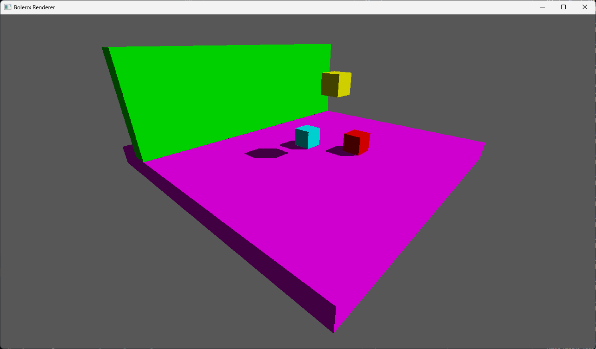

# Bolero

[](https://opensource.org/licenses/MIT)

Bolero is a minimal boilerplate graphics testbench that uses OpenGL 4.6 to help programmers build faster prototypes for their projects. 

Heavily inspired by Dihara Wijetunga's [dwSampleFramework](https://github.com/diharaw/dw-sample-framework)



Shadow Mapping example

## Classes

* **`AssetManager`**: Handles disk I/O for assets (`Mesh`, `Material`, `Shader`, `Model`, `Tex`). Prevents duplicate loading and automatically hot-reloads `.glsl` files on save. Creation of resources routes through here
* Wrappers: `VertexBuffer`, `IndexBuffer`, `UniformBuffer`, `ShaderStorageBuffer`. These are OpenGL buffer abstractions and uses OpenGL 4.6 DSA under the hood
* **`Scene`**: Has helper methods like `AddEntity()` and `AddLight()` to help out with scene management
* **`Renderer`**: A purely static class that only renders. It computes 64-bit sort keys (sorting by depth, shader, material, and mesh), uploads SSBOs, and issues `glDrawElements` calls
* **`RenderPass` & `RenderPipeline`**: Passes encapsulate specific OpenGL states (FBO bindings, culling) and tell the Renderer what to draw. The Pipeline executes them sequentially and profiles their CPU/GPU execution time automatically

## Usage Example

To create a new rendering pass, simply inherit from `RenderPass`. Here is a basic example of a shadow mapping pipeline:

#### 1. Shadow Pass

```cpp
#pragma once

#include <bolero.hpp>
#include "core/lights.hpp"

namespace blrc = blr::core;


class ShadowPass : public blrc::RenderPass
{
public:
    ShadowPass(const blrc::Ref<blrc::Shader>& depthShader)
    : RenderPass("Shadow Pass")
    , m_depthShader(depthShader)
    {
    }

    void Init() override
    {
        m_fbo = blrc::FrameBuffer::Create({ 1024, 1024, { blrc::ImgFmt::Depth32F } });
    }

    void Execute(blrc::Scene& scene) override
    {
        m_fbo->Bind();

        glEnable(GL_DEPTH_TEST);
        glDepthFunc(GL_LESS);
        glEnable(GL_CULL_FACE);
        glCullFace(GL_FRONT);
        glClear(GL_DEPTH_BUFFER_BIT);

        auto dirLights = scene.GetDirLights();
        if (dirLights.empty()) 
            return;
            
        blrc::DirLight sun = dirLights[0];

        blrc::vec3 lightDir  = blrc::Norm(sun.direction);
        blrc::vec3 targetPos = blrc::vec3(0.0f, 0.0f, 0.0f);
        float shadowDist     = 40.0f;
        blrc::vec3 lightPos  = targetPos - (lightDir * shadowDist);

        blrc::mat4 lightView = blrc::LookAt(lightPos, targetPos, blrc::vec3(0.0f, 1.0f, 0.0f));
        blrc::mat4 lightProj = blrc::Ortho(-40.0f, 40.0f, -40.0f, 40.0f, 1.0f, 80.0f);
        m_lightSpaceMatrix   = lightProj * lightView;

        blrc::Renderer::UpdateCameraUBO(lightView, lightProj, lightPos);
        blrc::Renderer::DrawQueue(m_depthShader.get()); 

        glCullFace(GL_BACK);
        m_fbo->Unbind();
    }

    void Shutdown() override {}

    GLuint GetDepthMap() const { return m_fbo->GetDepthAttachmentID(); }
    const blrc::mat4& GetLightSpaceMat() const { return m_lightSpaceMatrix; }

private:
    blrc::Ref<blrc::FrameBuffer> m_fbo;
    blrc::mat4 m_lightSpaceMatrix;
    blrc::Ref<blrc::Shader> m_depthShader;
};
```

#### 2. Opaque Pass

```cpp
#pragma once

#include <bolero.hpp>
#include "shadow.hpp"

namespace blrc = blr::core;


class OpaquePass : public blrc::RenderPass
{
public:
    OpaquePass(uint32_t initW, uint32_t initH, const blrc::Ref<blrc::Shader>& lightShader, const blrc::Ref<ShadowPass>& shadowPass)
    : RenderPass("Main Opaque Pass")
    , m_initW(initW)
    , m_initH(initH)
    , m_lightShader(lightShader)
    , m_shadowPass(shadowPass)
    {
    }

    void Init() override
    {
        m_fbo = blrc::FrameBuffer::Create({ m_initW, m_initH, { blrc::ImgFmt::RGBA8, blrc::ImgFmt::Depth32F} });
    }

    void Execute(blrc::Scene& scene) override
    {
        m_fbo->Bind(); 

        glEnable(GL_DEPTH_TEST);
        glDepthFunc(GL_LESS);
        glEnable(GL_CULL_FACE);
        glCullFace(GL_BACK);
        
        glClearColor(0.1f, 0.1f, 0.1f, 1.0f);
        glClear(GL_COLOR_BUFFER_BIT | GL_DEPTH_BUFFER_BIT);

        blrc::Renderer::UpdateCameraUBO(*scene.GetCam());

        m_lightShader->SetMat4("u_LightSpaceMat", m_shadowPass->GetLightSpaceMat());
        
        m_lightShader->SetInt("u_depthMapTex", 10);
        glBindTextureUnit(10, m_shadowPass->GetDepthMap());

        blrc::Renderer::DrawQueue(nullptr);

        m_fbo->Unbind();
    }

    virtual void OnResize(uint32_t width, uint32_t height) override
    {
        m_fbo->Resize(width, height);
    }

    void Shutdown() override {}

    GLuint GetColorMap() const { return m_fbo->GetColorAttachmentID(0); }

private:
    uint32_t m_initW;
    uint32_t m_initH;

    blrc::Ref<blrc::FrameBuffer> m_fbo;
    blrc::Ref<blrc::Shader> m_lightShader;
    blrc::Ref<ShadowPass>   m_shadowPass;
};
```

#### 3. Post Process Pass

```cpp
#pragma once

#include <bolero.hpp>
#include "passes/opaque.hpp"

namespace blrc = blr::core;


class PostPass : public blrc::RenderPass
{
public:
    PostPass(uint32_t width, uint32_t height, const blrc::Ref<blrc::Shader>& postShader, const blrc::Ref<OpaquePass>& opaquePass)
    : RenderPass("Post Pass")
    , m_windowW(width)
    , m_windowH(height)
    , m_postShader(postShader)
    , m_opaquePass(opaquePass)
    {
    }

    void Init() override
    {
    }

    void Execute(blrc::Scene& scene) override
    {
        glDisable(GL_DEPTH_TEST);     
        glDisable(GL_CULL_FACE);  

        glBindFramebuffer(GL_FRAMEBUFFER, 0);
        glViewport(0, 0, m_windowW, m_windowH); 
        glClearColor(0.1f, 0.1f, 0.1f, 1.0f);
        glClear(GL_COLOR_BUFFER_BIT);

        m_postShader->Bind();

        m_postShader->SetInt("u_ScreenTexture", 11);
        glBindTextureUnit(11, m_opaquePass->GetColorMap());

        blrc::Renderer::DrawFullscreenQuad();

        m_postShader->Unbind();
    }

    virtual void OnResize(uint32_t width, uint32_t height) override
    {
        m_windowW = width;
        m_windowH = height;
    }

    void Shutdown() override {}

private:
    uint32_t m_windowW;
    uint32_t m_windowH;

    blrc::Ref<blrc::Shader> m_postShader;
    blrc::Ref<OpaquePass> m_opaquePass;
};
```

### Chaining the passes

```cpp
// 1. Setup Scene Data
auto opaqueShader = assetManager.CreateShader("assets/shaders/light_pass.glsl");
auto model        = assetManager.CreateModel("assets/models/squares_and_things.gltf", opaqueShader);

scene.AddEntity(model, blrc::Transform{});

blrc::DirLight sun;
sun.direction  = blrc::EulToDir({ -45.0f, 45.0f, 0.0f });
sun.base.color = blrc::vec3(1.0f, 1.0f, 0.95f);
scene.AddLight(sun);

// 2. Initialize Renderer & Pipeline
blrc::Renderer::Init();
blrc::RenderPipeline shadowMapping;

// 3. Instantiate & Link Passes
auto depthShader = assetManager.CreateShader("assets/shaders/shadow_pass.glsl");
auto shadowPass  = std::make_shared<ShadowPass>(depthShader);
auto opaquePass  = std::make_shared<OpaquePass>(DEFAULT_WINDOW_WIDTH, DEFAULT_WINDOW_HEIGHT, opaqueShader, shadowPass);

auto postShader = assetManager.CreateShader("assets/shaders/post_pass.glsl");
auto postPass   = std::make_shared<PostPass>(DEFAULT_WINDOW_WIDTH, DEFAULT_WINDOW_HEIGHT, postShader, opaquePass);

shadowMapping.AddPass(shadowPass);
shadowMapping.AddPass(opaquePass);
shadowMapping.AddPass(postPass);

// 4. Main Loop Execution
while (!window.ShouldClose())
{
    assetManager.Update();         // Hot-reloads modified shaders automatically
    scene.Update(deltaTime, true); 
    
    blrc::Renderer::BeginFrame();
    
    shadowMapping.Execute(scene);  // Executes passes & profiles hardware time
    
    window.SwapBuffers();
}
```

## Building

Bolero uses CMake. It automatically fetches dependencies (`GLFW`, `GLM`, `Assimp`) via `FetchContent`.

```bash
mkdir build && cd build
cmake ..
cmake --build .
```

## Integrating as a Submodule

```bash
git submodule add https://github.com/KaindraDjoemena/Bolero.git extern/Bolero
git submodule update --init --recursive
```

```cmake
# Add Bolero
add_subdirectory(extern/Bolero)

# Link it to your executable
add_executable(RendererApp main.cpp)
target_link_libraries(RendererApp PRIVATE Bolero)
```

NOTE: `GLAD`, `stb`, `GLFW` and `GLM` are exposed, such that you can use them in your projects

## Dependencies

via `FetchContent`
- GLFW
- GLM
- Assimp

included in `extern/glad`
- stb (included in `extern/glad`)
- GLAD (included in `extern/glad`)

## TODOs

* [ ] Dear ImGui for real-time variable tweaking
* [ ] Cubemap class
* [ ] Cook-Torrance PBR & Image-Based Lighting (IBL)
* [ ] Deferred Shading Testbench