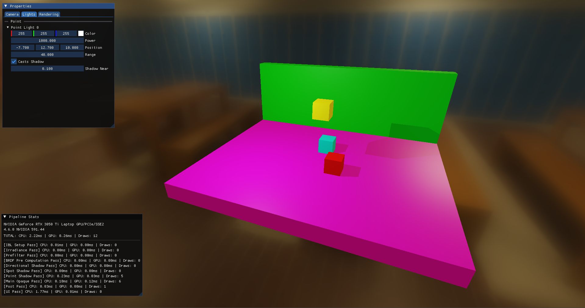

# Bolero

[](https://opensource.org/licenses/MIT)

Bolero is a minimal boilerplate graphics testbench that uses OpenGL 4.6 to help programmers build faster prototypes for their projects. 

Heavily inspired by Dihara Wijetunga's [dwSampleFramework](https://github.com/diharaw/dw-sample-framework)



Shadow Mapping example

## Classes

* **`AssetManager`**: Handles disk I/O for Resources (`Mesh`, `Material`, `Shader`, `Model`, `Tex`). Prevents duplicate loading and automatically hot-reloads `.glsl` files on save. Creation of resources routes through here
* **`VFS`**: Resolves virtual URIs (bolero://shaders/) to absolute paths
* Wrappers: `VertexBuffer`, `IndexBuffer`, `UniformBuffer`, `ShaderStorageBuffer`, `Cubemap`, `Framebuffer`, . These are OpenGL buffer abstractions and uses OpenGL 4.6 DSA under the hood
* **`Scene`**: Has helper methods like `AddEntity()` and `AddLight()` to help out with scene management
* **`Renderer`**: A purely static class that only renders. It computes 64-bit sort keys (sorting by depth, shader, material, and mesh), uploads SSBOs, and issues `glDrawElements` calls
* **`RenderPass`, `RenderPipeline`, `RenderContext`**: Passes encapsulate specific OpenGL states (FBO bindings, culling) and tell the Renderer what to draw. The Pipeline executes them sequentially and profiles their CPU/GPU execution time automatically. The `RenderContext` gets passed around passes to allow for modularity

## Usage Example

Here is a basic example of a forward rendering pipeline:

```cpp
// IBL Skybox Setup Pass
auto hdrMap = assetManager.CreateTex("bolero://hdri/newman_cafeteria_2k.hdr");
auto eqToCubeShader = assetManager.CreateShader("bolero://shaders/equirect_to_cubemap.glsl");
blrc::Ref<IBLSetupPass> iblPass = std::make_shared<IBLSetupPass>(eqToCubeShader, hdrMap);
// Scene Irradiance Pass
auto convolutionShader = assetManager.CreateShader("bolero://shaders/cubemap_convolution.glsl");
blrc::Ref<IrradiancePass> irradiancePass = std::make_shared<IrradiancePass>(convolutionShader);
// Environment Map Prefiltering Pass
auto prefilterShader = assetManager.CreateShader("bolero://shaders/prefilter.glsl");
blrc::Ref<PrefilterPass> prefilterPass = std::make_shared<PrefilterPass>(prefilterShader);
// BRDF LUT Pre Computation
auto brdfLutShader = assetManager.CreateShader("bolero://shaders/brdf_lut.glsl");
blrc::Ref<BrdfLutPass> brdfLutPass = std::make_shared<BrdfLutPass>(assetManager, brdfLutShader);
// Scene Depth Pass (Shadow Mapping)
auto depthShader      = assetManager.CreateShader("bolero://shaders/shadow_pass.glsl");
auto pointDepthShader = assetManager.CreateShader("bolero://shaders/point_shadow_pass.glsl");
blrc::Ref<DirShadowPass>   dirShadowPass   = std::make_shared<DirShadowPass>(depthShader);
blrc::Ref<SpotShadowPass>  spotShadowPass  = std::make_shared<SpotShadowPass>(depthShader);
blrc::Ref<PointShadowPass> pointShadowPass = std::make_shared<PointShadowPass>(pointDepthShader);
// Opaque Pass (Skybox, Mesh)
auto skyboxShader = assetManager.CreateShader("bolero://shaders/skybox.glsl");
blrc::Ref<OpaquePass> opaquePass = std::make_shared<OpaquePass>(DEFAULT_WINDOW_WIDTH, DEFAULT_WINDOW_HEIGHT
                                                                , opaqueShader, skyboxShader);
// Post Process Pass
auto postShader = assetManager.CreateShader("bolero://shaders/post_pass.glsl");
blrc::Ref<PostPass> postPass = std::make_shared<PostPass>(DEFAULT_WINDOW_WIDTH, DEFAULT_WINDOW_HEIGHT, postShader);
// UI Pass
blrc::Ref<UIPass> uiPass = std::make_shared<UIPass>(window.GetNativeWindow(), forwardRender.GetPasses());

// Add Passes to the pipeline
forwardRender.AddPass(iblPass);
forwardRender.AddPass(irradiancePass);
forwardRender.AddPass(prefilterPass);
forwardRender.AddPass(brdfLutPass);
forwardRender.AddPass(dirShadowPass);
forwardRender.AddPass(spotShadowPass);
forwardRender.AddPass(pointShadowPass);
forwardRender.AddPass(opaquePass);
forwardRender.AddPass(postPass);
forwardRender.AddPass(uiPass);
```

In the main loop:

```cpp
float currentFrame = static_cast<float>(glfwGetTime());
deltaTime = currentFrame - lastFrame;
lastFrame = currentFrame;

hotReloadTimer += deltaTime;
if (hotReloadTimer > 1.0f)
{
    assetManager.Update();
    hotReloadTimer = 0.0f;
}

window.PollEvents();

cam.HandleDrag(glm::vec2(input.GetMouseX(), input.GetMouseY()));

blrc::Renderer::BeginFrame();

scene.Update(deltaTime, true);

renderCtx.ClearTransient();
forwardRender.Execute(scene, renderCtx);  // pass scene

window.SwapBuffers();
```

## Building

Bolero uses CMake. It automatically fetches dependencies (`GLFW`, `GLM`, `Assimp`) via `FetchContent`.

```bash
mkdir build && cd build
cmake ..
cmake --build .
```

## Integrating as a Submodule

```bash
git submodule add https://github.com/KaindraDjoemena/Bolero.git extern/Bolero
git submodule update --init --recursive
```

```cmake
# Add Bolero
add_subdirectory(extern/Bolero)

# Link it to your executable
add_executable(RendererApp main.cpp)
target_link_libraries(RendererApp PRIVATE Bolero)
```

NOTE: `GLAD`, `stb`, `GLFW`, `GLM`, `ImGui`, and `ImPlot` are exposed, such that you can use them in your projects

## Dependencies

via `FetchContent`
- GLFW
- GLM
- Assimp

included in `extern/`
- stb
- GLAD
- Dear ImGui & ImPlot
